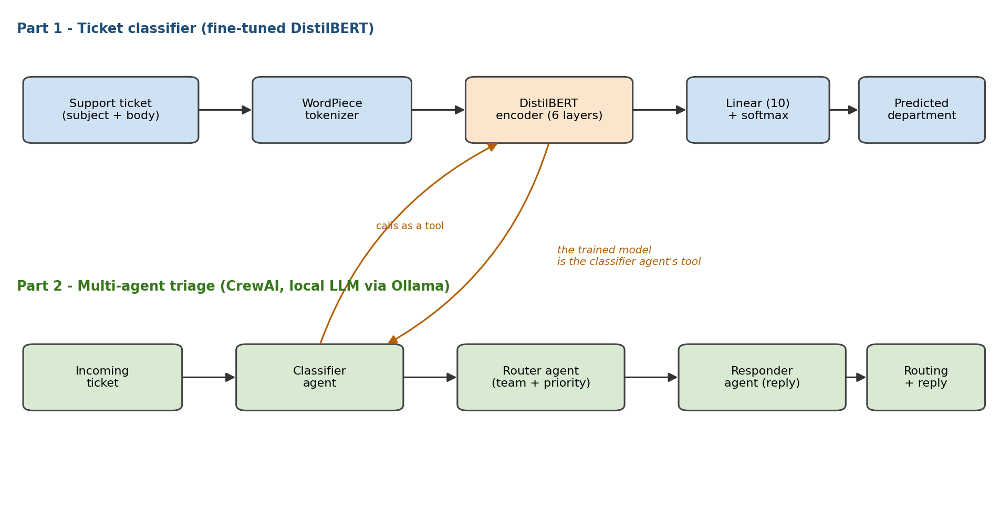
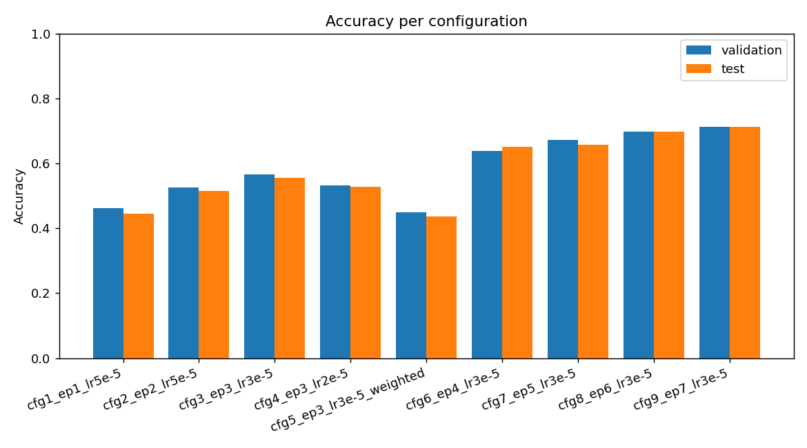

# Customer-Support Ticket Routing — DistilBERT + Multi-Agent Triage

[](https://huggingface.co/spaces/pxlnstn/ticket-routing-demo)
[](https://huggingface.co/pxlnstn/distilbert-ticket-routing)
[](#results-performance-comparison)
[](https://creativecommons.org/licenses/by-nc/4.0/)

A Deep Learning term project in two connected parts:

1. **Text classification** — fine-tune `distilbert-base-uncased` to route enterprise
   customer-support tickets into the correct **department** (e.g. *Technical Support*,
   *Billing and Payments*, *IT Support*). Includes the required performance comparison
   across several training configurations (table + charts of Loss/Accuracy).
2. **Multi-Agent Agentic AI** — a [CrewAI](https://www.crewai.com/) crew of three
   agents that triages a ticket. One agent calls the **trained DistilBERT model as a
   tool**, so the two parts form a single story: *the ML model becomes the brain of an
   autonomous triage workflow.*

Everything runs **locally** on an NVIDIA GPU. The agents are driven by a **local LLM
via Ollama** (no API key, no cost).

**Best result: 71.3% test accuracy** (81.6% top-2) routing tickets into 10 departments —
up from a 45% baseline. See [Results](#results-performance-comparison).



*The fine-tuned DistilBERT (Part 1) becomes a tool the classifier agent calls (Part 2).*

---

## Project structure

```
distilbert-text-classification/
├── README.md                  # this file
├── PAPER.docx                 # the write-up / publication (all required sections)
├── DEMO_SCRIPT.md             # teleprompter for the demo video
├── requirements.txt           # exact pinned library versions
├── src/
│   ├── check_gpu.py           # verify CUDA / GPU
│   ├── data_prep.py           # load + clean + split the dataset
│   ├── explore_data.py        # print dataset properties
│   ├── train.py               # fine-tune DistilBERT once (also a library)
│   ├── run_experiments.py     # the graded multi-config comparison
│   ├── classifier_tool.py     # use the trained model (function + CLI)
│   └── bigstack.py            # Windows/Py3.13 stack-overflow workaround
├── agent/
│   ├── crew_ticket_triage.py  # 3-agent CrewAI triage crew
│   ├── Modelfile              # defines the local Ollama model
│   └── example_output.md      # saved example run (for screenshots)
└── results/                   # results.csv + charts (committed); baseline_subset8k/
```

`.venv/` and `models/` are generated locally and git-ignored.

---

## Dataset

- **Source:** [`Tobi-Bueck/customer-support-tickets`](https://huggingface.co/datasets/Tobi-Bueck/customer-support-tickets) (HuggingFace), license CC-BY-NC-4.0 (academic use).
- **Topic:** enterprise customer-support / IT-incident ticket routing.
- **Target (label):** `queue` — the department, **10 classes**:
  Technical Support, Product Support, Customer Service, IT Support,
  Billing and Payments, Returns and Exchanges, Service Outages and Maintenance,
  Sales and Pre-Sales, Human Resources, General Inquiry.
- **Input feature:** one text field built from the ticket `subject` + `body`.
- **Samples used:** English rows only = **28,261**, split (stratified) into
  **22,608 train / 2,826 validation / 2,827 test**.
- **Note:** the classes are imbalanced (Technical Support ≈ 29% vs General Inquiry ≈ 1%),
  so we report **macro-F1** alongside accuracy. Run `python src/explore_data.py` to
  print these properties.

---

## Requirements (exact pinned versions)

Python **3.13**, an NVIDIA GPU with a recent driver (developed on an **RTX 4070 Laptop,
8 GB**, driver 555.97, CUDA 12.5), and Ollama for the agent part.

Key libraries (full list in [requirements.txt](requirements.txt)):

| Library | Version | | Library | Version |
|---|---|---|---|---|
| torch | 2.6.0+cu124 | | scikit-learn | 1.9.0 |
| transformers | 4.57.6 | | pandas | 3.0.3 |
| datasets | 4.8.5 | | matplotlib | 3.10.9 |
| evaluate | 0.4.6 | | numpy | 2.4.6 |
| accelerate | 1.13.0 | | crewai | 1.14.6 |
| tokenizers | 0.22.2 | | crewai-tools | 1.14.6 |

> `torch==2.6.0+cu124` must be installed from the PyTorch CUDA wheel index (see below);
> it is not on plain PyPI.

---

## Setup (one time)

```powershell
# 1. Create and activate an isolated virtual environment
py -m venv .venv
.\.venv\Scripts\Activate.ps1            # PowerShell

# 2. Install CUDA-enabled PyTorch FIRST (matches the GPU driver)
pip install torch --index-url https://download.pytorch.org/whl/cu124

# 3. Install everything else
pip install transformers==4.57.6 datasets evaluate accelerate scikit-learn pandas matplotlib crewai crewai-tools

# (or reproduce the exact environment)
pip install -r requirements.txt
```

For the agent part, install **[Ollama](https://ollama.com)**, pull a small model, and
create the project's context-limited model (the small context keeps the KV cache
inside an 8 GB GPU that is also driving the display):

```powershell
ollama pull llama3.2:3b
ollama create ticket-triage-llm -f agent/Modelfile
```

> Prefer the bigger `llama3.1` (needs more free VRAM)? Run
> `$env:OLLAMA_MODEL="ollama/llama3.1:latest"` before step 6.

---

## How to run (in order)

```powershell
# Step 1 - confirm the GPU is detected (stops with help if CUDA is missing)
python src/check_gpu.py

# Step 2 - print the dataset properties (for the paper)
python src/explore_data.py

# Step 3 - quick smoke test (~1 min) to confirm the training pipeline works
python src/train.py --subset 2000 --epochs 1 --lr 5e-5 --out models/smoke

# Step 4 - the graded comparison: trains the configs, writes the table + charts,
#          prints which config is best, and saves the best model.
#          Use --full for the final paper numbers (full dataset; ~25-35 min).
python src/run_experiments.py --full
#   -> results/results.csv, results/accuracy.png, results/loss.png, results/f1_macro.png
#   -> models/distilbert-ticket-best/   (best config by validation accuracy)
#   Resumable: re-run to skip finished configs and just rebuild the table/charts.

# Step 5 - try the trained classifier directly on one ticket
python src/classifier_tool.py "I was charged twice on my last invoice"

# Step 6 - run the multi-agent triage crew (needs Ollama running)
python agent/crew_ticket_triage.py
```

---

## Results (performance comparison)

Final runs on the **full** dataset (22,608 train / 2,826 val / 2,827 test), 256-token
inputs. Full numbers in [results/results.csv](results/results.csv) and the charts. An
earlier 8,000-example baseline is kept in
[results/baseline_subset8k/](results/baseline_subset8k/) for the progress comparison.

| config | epochs | lr | test acc | test top-2 | test macro-F1 |
|---|---|---|---|---|---|
| cfg1 | 1 | 5e-5 | 44.5% | – | 0.34 |
| cfg2 | 2 | 5e-5 | 51.4% | – | 0.42 |
| cfg3 | 3 | 3e-5 | 55.6% | – | 0.46 |
| cfg4 | 3 | 2e-5 | 52.9% | – | 0.43 |
| cfg5 | 3 | 3e-5 (class-weighted) | 43.6% | – | 0.45 |
| cfg6 | 4 | 3e-5 | 65.1% | – | 0.58 |
| cfg7 | 5 | 3e-5 | 65.8% | – | 0.60 |
| cfg8 | 6 | 3e-5 | 69.8% | 81.7% | 0.65 |
| **cfg9** | **7** | **3e-5** | **71.3%** | **81.6%** | **0.68** |



**Best: cfg9 (7 epochs, learning rate 3e-5) — 71.3% test accuracy.** Interpretation:

- **Epochs were the biggest lever.** Test accuracy climbed steadily with more training
  (45% → 51 → 56 → 65 → 66 → 70 → **71%**); validation and test track closely, so the
  model generalises (not over-fitting). Learning rate 3e-5 was the sweet spot.
- **Performance-improvement story (Appendix 1):** moving from an 8k subset / 128 tokens /
  3 epochs (**45.4%**) to full data / 256 tokens / 7 epochs (**71.3%**) is a **+25.9-point**
  gain.
- **Class-weighting trade-off (cfg5):** weighting the loss for rare classes slightly
  raised macro-F1 but *lowered* accuracy — a fairness-vs-accuracy trade-off, so the
  unweighted model is deployed.
- **Top-2 accuracy 81.6%:** the correct department is in the model's two best guesses
  ~82% of the time — a fair metric for routing, given the overlapping departments
  (Technical Support / IT Support / Product Support).
- Context: 71% on **10 imbalanced classes** is ~2.5× the majority-class baseline (29%)
  and ~7× random (10%).

## What each file does

| Path | Purpose |
|---|---|
| `src/check_gpu.py` | Verifies CUDA + prints the GPU name; exits with fix instructions if CUDA is unavailable. |
| `src/data_prep.py` | Loads the dataset, keeps English rows, builds the text field, maps the 10 queues to label ids, makes the stratified train/val/test split. Imported by the others. |
| `src/explore_data.py` | Prints dataset properties (topic, #classes, #samples, #features, class balance). |
| `src/train.py` | Fine-tunes DistilBERT **once** (configurable epochs/lr/subset). Also a library: `train_model(...)`. |
| `src/run_experiments.py` | Runs the **≥4 configurations**, writes `results/results.csv` + charts, picks the best, copies it to `models/distilbert-ticket-best/`. Resumable + auto-retries transient GPU errors. |
| `src/classifier_tool.py` | Loads the trained model and exposes `classify_ticket(text)`. Also a CLI. This is the bridge to the agent part. |
| `src/bigstack.py` | Small helper that runs the program in a large-stack thread (Windows/Py3.13 fix — see Troubleshooting). |
| `agent/crew_ticket_triage.py` | The CrewAI crew: Classifier → Router → Responder agents; the Classifier agent calls `classify_ticket` as a tool. |
| `agent/Modelfile` | Defines the `ticket-triage-llm` Ollama model (llama3.2:3b + small context). |
| `agent/example_output.md` | A clean example input/output from the crew, for the paper/screenshots. |
| `requirements.txt` | Exact pinned versions of every package. |
| `PAPER.docx` | The publication write-up (Abstract → Conclusion + Appendices 1–6). |
| `DEMO_SCRIPT.md` | Scene-by-scene teleprompter for recording the demo video. |
| `results/` | `results.csv` + charts (committed); `baseline_subset8k/` keeps the early baseline. `models/` is generated locally and git-ignored. |

---

## The multi-agent crew (Part E)

- **Framework:** CrewAI. **LLM:** local `ticket-triage-llm` (llama3.2:3b, 4k context)
  via Ollama — no API key, no cost. **Process:** sequential (each agent builds on the
  previous one's output).
- **Agent 1 — Ticket Classification Specialist:** calls the `ticket_classifier` tool
  (our fine-tuned DistilBERT) to predict the department.
- **Agent 2 — Support Triage Router:** maps the department to a team + priority.
- **Agent 3 — Customer Response Writer:** drafts a short acknowledgement to the customer.

Run it and screenshot the input ticket and the three agents' outputs. A saved example is
in [agent/example_output.md](agent/example_output.md).

---

## Troubleshooting (and why the code is shaped this way)

These are real issues hit while building on Windows 11 + Python 3.13; the fixes are
baked into the code.

- **Windows fatal exception: stack overflow / random crash on import.**
  The deep `torch + transformers + sklearn + pandas` import graph overflows Windows'
  small default thread stack on Python 3.13. **Fix:** every entry script runs inside a
  64 MB-stack thread via `src/bigstack.py`, with heavy imports placed *inside* that
  thread.
- **`CUDA error: unknown error` during the backward / fp16 forward pass.**
  The fused flash-attention kernel is unstable on this GPU/driver combo. **Fix:** the
  model is loaded with `attn_implementation="eager"` (plain softmax attention).
- **Occasional `CUDA error: unknown error` mid-training (intermittent).**
  This GPU throws a transient error now and then. **Fix:** `run_experiments.py` is
  **resumable** (finished configs are skipped) and **retries** each config up to 3
  times. If it persists, close other GPU/RAM-heavy apps (browser, WSL, Docker) and
  re-run.
- **`MemoryError` while saving the model.**
  Saving needs a contiguous RAM buffer and this machine can be low on free RAM.
  **Fix:** training frees the optimizer + GPU cache before saving; closing WSL/Docker/
  spare browser tabs also helps.
- **First run downloads** the model (~268 MB) and dataset from HuggingFace; later runs
  use the local cache.
- **Ollama `cudaMalloc failed: out of memory` / `kv cache` error.**
  An 8 GB laptop GPU shares VRAM with the display, so only ~5 GB is usable and the
  models default to a huge 128k context. **Fix:** use `ticket-triage-llm` (llama3.2:3b
  with a 4k context, see `agent/Modelfile`) instead of the 8B model.
- **CrewAI `can't start new thread`.** CrewAI spawns helper threads and the 64 MB
  import-stack was being applied to each. **Fix:** the agent resets the thread stack
  size to default after imports (`threading.stack_size(0)`).
- **`'charmap' codec can't encode` emoji error on Windows.** CrewAI prints emoji to a
  cp1252 console. **Fix:** the agent reconfigures stdout/stderr to UTF-8 at startup.
- **Apps (VS Code) crashing with `oom`.** The whole machine is out of RAM, not a bug
  here. Close WSL (`wsl --shutdown`), Docker, and spare browser/editor windows, or
  reboot, before running training or the agent.
